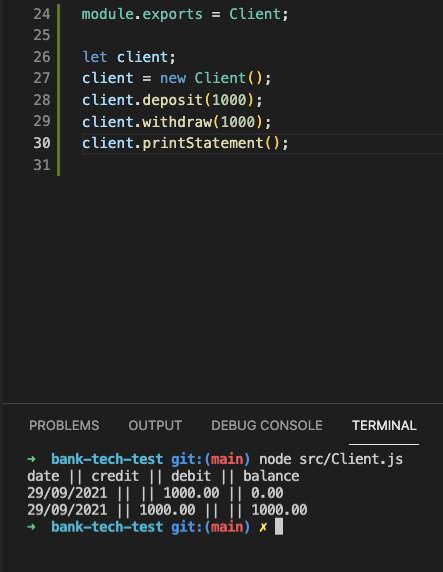
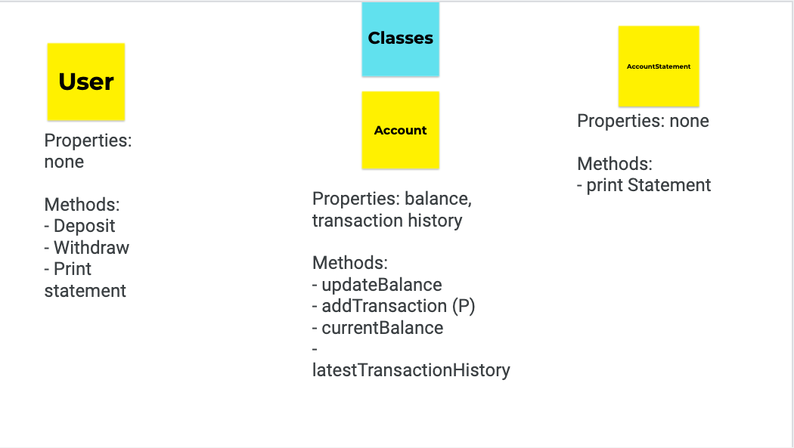
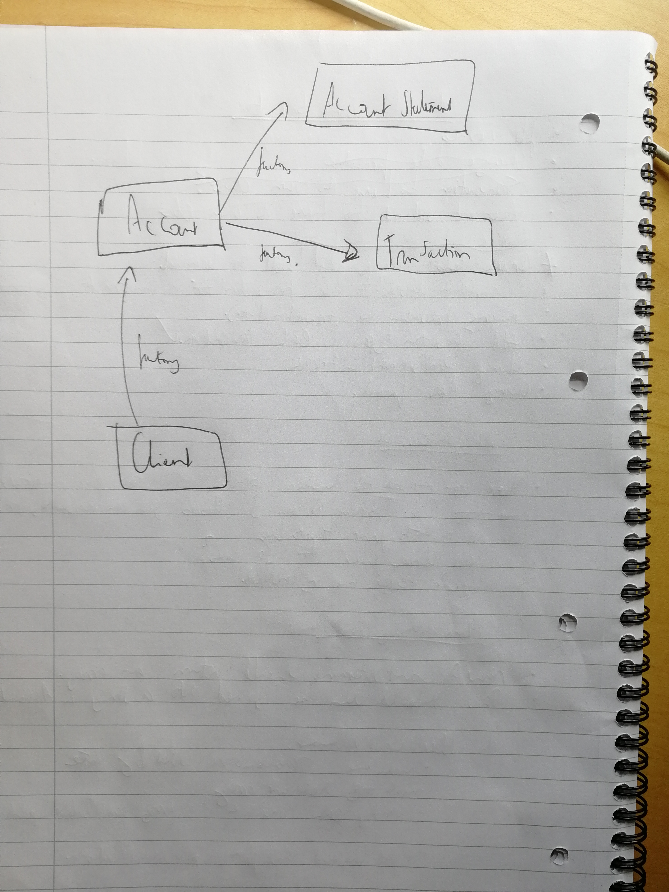

# Bank tech test (Makers Academy week 10)

## Requirements

- You should be able to interact with your code via a REPL like IRB or the JavaScript console. (You don't need to implement a command line interface that takes input from STDIN.)
- Deposits, withdrawal.
- Account statement (date, amount, balance) printing.
- Data can be kept in memory (it doesn't need to be stored to a database or anything).

## Acceptance criteria

**Given** a client makes a deposit of 1000 on 10-01-2012  
**And** a deposit of 2000 on 13-01-2012  
**And** a withdrawal of 500 on 14-01-2012  
**When** she prints her bank statement  
**Then** she would see

```
date || credit || debit || balance
14/01/2012 || || 500.00 || 2500.00
13/01/2012 || 2000.00 || || 3000.00
10/01/2012 || 1000.00 || || 1000.00
```

## Usage

### How to run program:

In Client.js:

```
let client;
client = new Client();
client.deposit(1000);
client.withdraw(1000);
client.printStatement();
```

Then from the console: node src/Client.js

### How to run tests:

```
jasmine
```

### Example:



## User Stories

I used Jamboard to model the program. I ended having an additional Transaction class compared the initial diagram

## Class Diagram v1



## Approach

- Once I was happy with my domain model, I did some research on the 4 key pillars of OOP to ensure that my program was going to adhere to these principles

- I then began building the account class using TDD. I then did the same for a Client class to provide a clear public interface for the user to interact with.

- I found that that these two classes could manage most of the required functionality. I decided to extract logic out of the Account class into Transaction class and Account Statement to ensure alignment to OOP best practices.

- To help me with the above extraction I drew out a simple diagram to help me visualise the information flows



<br>


